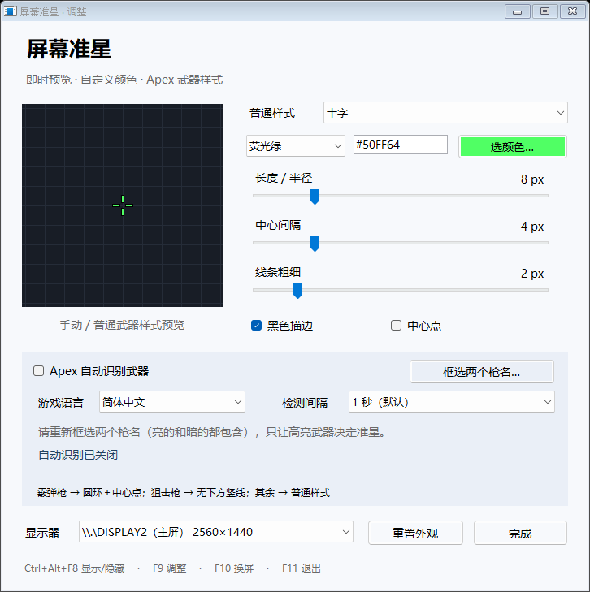

# 屏幕准星 · ScreenCrosshair

一个轻量的 Windows 屏幕准星工具。双击运行，在显示器正中央显示透明、置顶且可穿透鼠标点击的准星。

[下载最新版 EXE](https://github.com/JackyWilliam/ScreenCrosshair/releases/latest/download/ScreenCrosshair.exe) · [版本与完整压缩包](https://github.com/JackyWilliam/ScreenCrosshair/releases)



## 功能

- 始终置顶，显示和隐藏时不抢走当前程序的键盘焦点。
- 鼠标点击穿透准星，通知区域图标提供设置和退出入口。
- 十字、圆点、圆环三种样式，六种颜色，可调整长度、间隔、粗细、描边和中心点。
- 新增霰弹枪“圆环＋中心点”和狙击枪“去掉下方竖线”样式。
- 深色设置界面、自定义标题栏与统一图标；托盘图标区分开启和隐藏状态。
- 调色板与 `#RRGGBB` 自定义颜色；长度、间隔、粗细支持滑块和数字输入，最多保存两位小数。
- 三叉（奔驰）、X 形与自定义组合：单独开关上下左右直线、四个方向斜线、圆环和中心点。
- 普通（十字）、霰弹枪、狙击枪各有独立预设列表：保存、更新、套用、删除互不影响，重启后保留所有部件开关。
- 普通、霰弹枪、狙击枪三套独立配置，分别保存样式、颜色、长度、间隔、粗细、描边和中心点。
- 通用参数一键同步：从当前编辑类别复制尺寸、颜色与描边到另外两类，保留各类形状和部件开关。
- 可选的 Apex 局部画面武器识别，自动切换霰弹枪 / 狙击枪 / 普通样式。
- 多显示器切换，按完整显示器尺寸居中。
- 设置即时生效并自动保存，重复运行会打开已有实例的设置。
- 无需安装、管理员权限或额外依赖；不设置开机启动。

## 使用

从 Releases 下载并运行 `ScreenCrosshair.exe`。默认在主屏显示绿色十字。

| 快捷键 | 操作 |
| --- | --- |
| Ctrl + Alt + F8 | 显示 / 隐藏 |
| Ctrl + Alt + F9 | 打开设置 |
| Ctrl + Alt + F10 | 切换显示器 |
| Ctrl + Alt + F11 | 退出程序 |

双击任务栏通知区域的准星图标也能打开设置，右击可退出。关闭设置窗口后，准星继续运行。快捷键如被其他程序占用，会提示使用托盘菜单。

设置保存到 `%LOCALAPPDATA%\ScreenCrosshair\settings.xml`。

在设置顶部的“正在调整”选择**普通（十字）、霰弹枪、狙击枪**，再调整该配置的颜色、滑块和样式。左侧预览跟随所选配置；选择编辑对象不会强制切换游戏准星。自动识别确认武器后会使用对应的整套配置，关闭识别或连续识别失败时使用普通配置。“重置当前”只重置正在编辑的那一套。

点击底部“同步通用参数”，将**当前正在调整的类别**的长度 / 半径、中心间隔、线条粗细、颜色、黑色描边复制到另外两类。每类的形状、中心点、线条 / 圆环开关和斜线角度保持原样，已保存的预设也保持原样。这是一次性复制，之后继续调整仍然互不影响；识别开关、枪名框选范围和显示器设置不受影响。

### 自定义部件、小数尺寸与预设

在右侧样式下拉框选择“自定义组合”，即可分别开启或隐藏上 / 下 / 左 / 右直线、四个方向的斜线、圆环；“中心点”开关仍可单独调整。所有部件都关闭时准星完全透明。

也可先选“三叉（奔驰）”或“X 形”，再切到“自定义组合”继续修改。三叉模板的三个方向相隔 120°，转换为自定义后保留角度；开启“圆环”可得到三叉圆环。圆环与线条组合时外圈对齐线条末端；“中心间隔”设为 0 可让线条在中心相接。

像素输入框可直接输入 `1.25`、`4.5` 等数值，最多保留两位小数。滑块以 0.1 px 调整，输入框上下键也可微调；长度 / 半径 2–32 px、间隔 0–20 px、粗细 0.1–8 px。无效或越界输入不会覆盖最近的有效值，离开输入框后自动恢复。小数尺寸通过半透明边缘呈现，预览与屏幕准星使用相同绘制结果。

1. 选择普通（十字）、霰弹枪或狙击枪，调整到喜欢的外观；右侧仅显示该类别的预设列表。
2. 在对应的“普通预设 / 霰弹枪预设 / 狙击枪预设”旁点击“保存…”，输入名称。当前类别已有同名预设时按钮变为“更新”；不同类别可以使用相同名称。
3. 从下拉框选择已保存预设，点击“套用”，仅修改当前编辑的武器配置。之后继续调整不会改动已保存的预设。
4. 点击“删除”并确认即可移除当前类别的所选预设；其他类别的预设和已套用外观保留。

升级到 v1.3.2 时，旧版共享预设会各复制一份到三个独立列表，原有预设不会丢失；此后保存、更新和删除只作用于当前类别。三类配置、显示器、识别开关和枪名框选范围保留。退出旧版后再运行新版；退出前已保存的配置继续使用。

首次升级到 v1.2.0 时，会将原有共享颜色、尺寸等复制给两套新配置，霰弹枪默认圆环加中心点，狙击枪默认无下方竖线。之后三套互不影响。v1.1.1 已框选的区域和检测间隔会保留，无需重新框选。

适用于 Windows 10 / 11 桌面、窗口化或无边框窗口。独占全屏可能不显示，此时请改用无边框窗口；尚未针对具体游戏验证兼容性。

## Apex 自动切换（实验性）

1. 在 Apex 训练场拿起武器，确保右下角的两个武器名称都可见。
2. 按 `Ctrl+Alt+F9` 打开设置，选择游戏语言：简体中文或 English。
3. 点击“框选两个枪名…”，在 20 秒内切回 Apex，拖动框选**两个武器名称，亮的和暗的都包含**。尽量只框枪名，避开上方枪械图标、弹药数字和拾取提示；按 Esc 取消。
4. 框选完成后自动启用识别。关闭设置并回到 Apex 即开始检查；可在设置中关闭自动模式。

程序同时定位两个枪名，比较原始画面中枪名文字的亮度，仅用明显高亮的枪名决定配置。永久亮着的数字键提示不会参与比较；两个名字都暗、同样亮或差异太小时暂不确认。霰弹枪使用霰弹枪配置；狙击枪以及 G7、30-30、波塞克、三重式（神射手）使用狙击枪配置；其余武器使用普通配置。这是本工具的准星配置分组。

**从 v1.1.0 更新后需要重新框选两个枪名。** 旧的单枪名区域会停用，颜色、滑块、手动样式和检测间隔保留。

默认每 1 秒检查一次，可选 0.5 / 1 / 2 秒。连续两次识别到同一武器才切换；连续三次无法识别时恢复普通样式。换枪因此存在延迟，较长间隔会降低识别次数，但增加切换和恢复时间。不要把未完成的换枪动画当成已切换。

v1.3.3 修复 30-30 等短数字枪名的漏读：首轮没有确认武器、且只读到不足两个候选时，再对选区放大并增强对比识别一次。高亮仍按原始画面判断；已读到两个候选但亮度不明确时继续等待，不猜选。状态记录会同时显示“原图”和“增强”的 OCR 文字，原有框选范围与三套配置保留。

v1.3.5 补充中文 OCR 将 `30-30` 读成 `3 囗 一 3 囗` 的情况：只对完整的“3、零形字符、横线、3、零形字符”进行校正，不猜测缺失数字、`50-30` 或散落的弹药数字。识别后的枪名仍须通过原始亮度筛选和连续两次确认。

只在 Apex 位于前台时读取选定区域。图片仅在进程内存中处理，用完释放，**不保存截图、不上传、不录屏**；同一时刻最多处理一张，繁忙时跳过检测，不积压任务。切出 Apex 会暂停并恢复普通样式。调整 HUD 位置、缩放、语言或窗口布局后，如识别不准，请重新框选。

使用 Windows 自带 OCR，需安装对应语言的文字识别组件；缺失时状态栏会提示并暂停识别。遇到黑屏、名字读不到或区域过大，使用无边框窗口并重新框选小范围的枪名。识别失败会保留普通准星，程序不绕过游戏的画面捕获限制。

### 暂停与识别失败

- “Apex 窗口限制截图”：Windows 报告游戏窗口限制画面捕获。v1.3.4 起暂停截图和 OCR、清空本次 OCR 文字并恢复普通配置，避免读到游戏背后的桌面。只继续检查窗口属性，限制解除且 Apex 位于前台后自动重试；不修改游戏窗口属性，也不能据此判断是谁设置了限制。
- “Apex 不在前台”：打开设置、聊天、其他窗口或游戏最小化会暂停；切回游戏自动继续，仍需连续两次确认。
- “未读到枪名”或“枪名高亮不明确”：检测还在运行，本次没有可靠结果。枪名消失、换枪动画、文字过小或亮暗变化都可能导致这种情况。
- “只读到暗色枪名”：只有备用武器的名称被认出，亮色武器名称可能漏读；程序不会把暗色武器当成激活武器。
- “识别已暂停：…”后跟错误信息：捕获或 OCR 出错，检查提示后重新启用自动识别以重试。

点击“状态记录”可查看本次运行最近 30 次状态变化及时间、最近一次检测结果、OCR 原始文字。记录只保存在内存，退出清空，不新增截图或日志文件。外观调整不会重置识别确认；更改识别开关、语言、间隔或区域才重新初始化。没有现场记录时，不能仅凭后来恢复正常判断此前的具体原因。

这不是官方授权工具。EA 没有明确豁免外置准星或武器识别，不读内存或不注入游戏也不能保证合规或不会封号，参见 [Apex 官方规则](https://help.ea.com/en/articles/apex-legends/play-by-the-rules/)。真实游戏中的准确率、帧率影响和兼容性尚需用户验证。

## 构建

在 Windows PowerShell 中运行：

```powershell
.\source\build.ps1
```

脚本使用 Windows 自带的 .NET Framework C# 编译器，输出仓库根目录下的 `ScreenCrosshair.exe`。

## 验证

v1.3.5 在本机通过 165 项断言，覆盖中英文 OCR、高亮筛选、神射手使用狙击配置、三套配置迁移与独立保存、小数输入与错误恢复、分数像素透明度、独立部件显隐、三叉和 X 形几何、自定义转换、三类预设隔离/迁移/更新/删除及重载、通用参数同步与形状保留、编辑/预览/单套重置、识别后选择完整配置和状态记录上限。包含较高 HUD 选区中的 30-30 / 莫桑比克亮暗互换、同亮、同暗、空白、拒绝错误数字别名、完整中文误读校正及校正后的亮度检查。

截图限制检测在测试进程自己的隐藏窗口上验证：限制值 `1` / `0x11` 均暂停、清空旧文字、恢复普通配置、废弃待返回结果；解除限制后允许重试并重新累计两次确认，重复暂停不挤满状态记录。测试不设置 Apex 的窗口属性，也不操作真实游戏；该修复只明确诊断和暂停，不能恢复被排除的游戏画面。

本次现场 HUD 样本中，原流程把 `30-30` 读成 `50-30`，只读到暗色莫桑比克；增强重试后正确选择 30-30 并使用狙击配置，同一静态样本重复 20 次均通过。这是现场图片回放验证，尚未覆盖所有换枪动画、亮度和 HDR 场景；样本仅用于本地排障，未加入公开仓库。

另一个现场样本中，亮色 `30-30` 被读成 `3 囗 一 3 囗`，旧版只认出暗色克雷贝尔并提示“高亮不明确”。校正后 30-30 / 克雷贝尔的亮度分别为 250 / 171，按原有阈值即可选中 30-30，无需放宽高亮判断。

一张用户提供的 Apex HUD 图片中，左侧暗色“赫姆洛克突击步枪”、右侧亮色“莫桑比克”，在原尺寸和枪名局部放大两种输入下均正确选中莫桑比克。该图片未放入公开仓库。静态图片和合成测试不等同于真实游戏验收，HDR、不同亮度设置及换枪动画仍需实测。

运行回归（设置测试窗口在屏幕外渲染，准星会短暂显示；不会启动或操作游戏）：

```powershell
.\tests\run.ps1
```

可选的 `-Interactive` 测试会显示一个合成武器 HUD，验证屏幕局部捕获。运行时保持测试窗口在前台；若焦点被其他窗口切走，测试会失败。测试构建限制为只能捕获自身窗口，不能捕获正在运行的真实 Apex。

实现参考：[Windows layered windows](https://learn.microsoft.com/en-us/windows/win32/winmsg/window-features)、[RegisterHotKey](https://learn.microsoft.com/en-us/windows/win32/api/winuser/nf-winuser-registerhotkey)、[UpdateLayeredWindow](https://learn.microsoft.com/en-us/windows/win32/api/winuser/nf-winuser-updatelayeredwindow)。

## 许可证

本项目采用 [MIT 许可证](LICENSE)。Copyright (c) 2026 JackyWilliam。

允许使用、修改、分发及商用；分发软件副本或实质性部分时，须保留版权声明和许可声明。软件按原样提供，不提供任何担保。完整条款以 [LICENSE](LICENSE) 为准。
